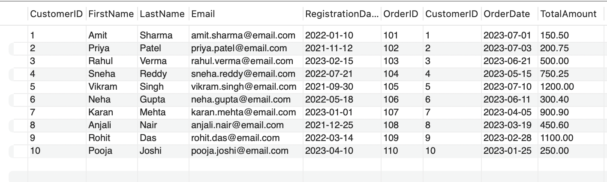
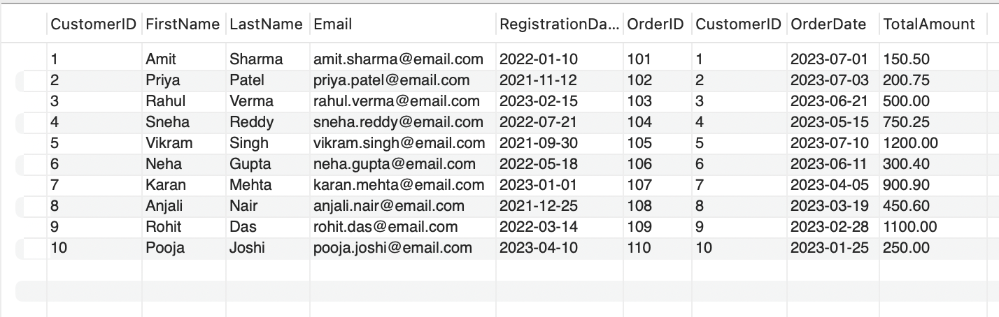
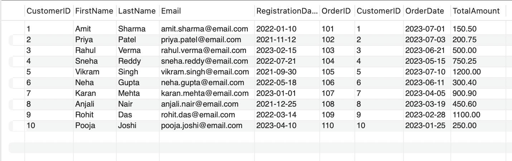
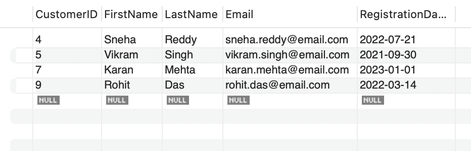
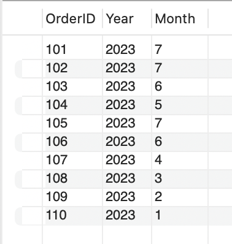
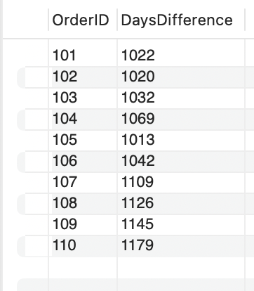
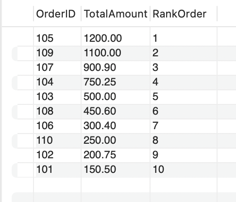

Here is your **pure README.md code** (no extra text, ready to paste):

```md
# 📊 SQL Project – Customer & Orders Analysis

## 📁 Project Structure
```

SQL_PR2/
│── DataTransformer.sql
│── README.md
│
└── Screenshots/
├── s1.png
├── s2.png
├── s3.png
├── s4.png
├── s5.png
├── s6.png
├── s7.png

```

---

## 📌 Project Description
This project is based on SQL queries to manage and analyze **Customer and Orders data**.  
It includes table creation, data insertion, filtering, date operations, ranking, and aggregation.

---

## 🗂️ Database Details

### Customers Table
- CustomerID  
- FirstName  
- LastName  
- Email  
- RegistrationDate  

### Orders Table
- OrderID  
- CustomerID  
- OrderDate  
- TotalAmount  

---

## ⚙️ Features Implemented

- Table creation using SQL  
- Inserting Indian sample data (10 records each)  
- Filtering data using conditions  
- Working with NULL values  
- Date functions (YEAR, MONTH, DATEDIFF)  
- Ranking using window functions  
- Sorting and grouping  

---

## 📸 Sample Outputs

### 🔹 Customer & Orders Data


### 🔹 Full Data View


### 🔹 Joined Data


### 🔹 Filtered Customers


### 🔹 Extract Year & Month


### 🔹 Date Difference Calculation


### 🔹 Ranking Orders by Amount


---

## 🧠 Concepts Used

- SELECT, WHERE, BETWEEN  
- JOIN operations  
- GROUP BY & HAVING  
- ORDER BY  
- Window Functions (RANK)  
- Date Functions  

---

## ▶️ How to Run

1. Open MySQL Workbench or VS Code  
2. Load `DataTransformer.sql`  
3. Execute all queries  
4. View results  

---

## 🎯 Conclusion

This project demonstrates practical use of SQL for:
- Data management  
- Data analysis  
- Real-world query writing  
```
